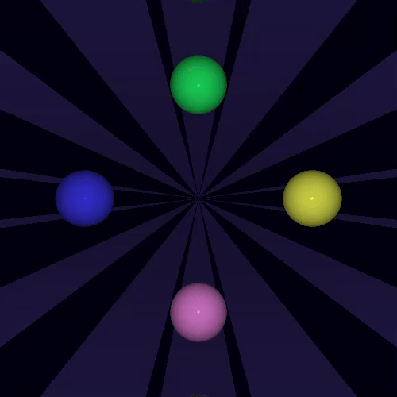

# 🎨 Ray Tracing Animation in C++
This project implements a simple ray tracer in C++ that renders a 3D scene with spheres and planes. It produces a sequence of image frames showing animated transformations of spheres, which can be combined to create an animation GIF.

## ⚙️ Features
 - Ray-sphere and ray-plane intersection
 - Lighting model with ambient, point, and directional lights
 - Recursive reflections with configurable depth
 - Animated sphere movements over multiple frames
 - Output images in PPM format (plain text)

## 📁 Files
- raytracer.cpp — The main C++ source code
- frames/ — Folder containing the generated .ppm image frames (frame_0.ppm, frame_1.ppm, ...)

## 🚀 Compilación

```bash
g++ raytracer.cpp -o raytracer
